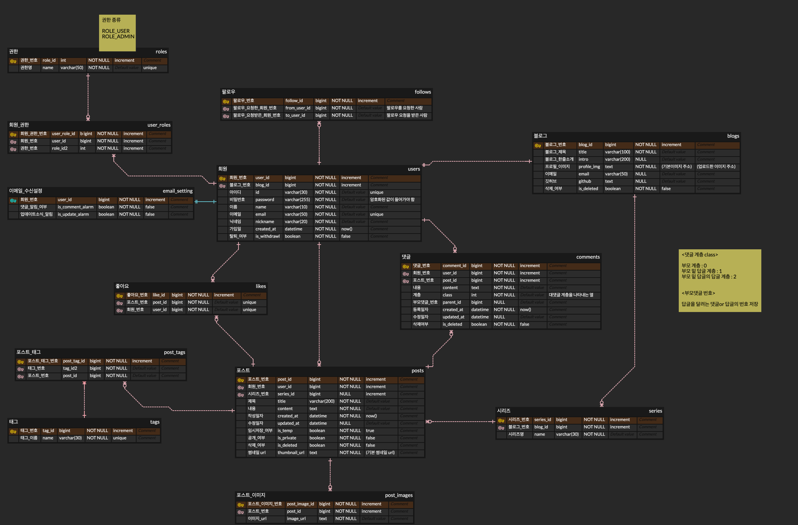

# 📄 목차
- [💬 프로젝트 소개](#-프로젝트-소개) 
- [🚀 핵심 기능](#-핵심-기능) 
- [🗓️ 작업 기간](#%EF%B8%8F-작업-기간) 
- [👩🏻‍💻 구성원](#-구성원) 
- [🛠️ 기술 스택](#%EF%B8%8F-기술-스택) 
- [🚧 아키텍처](#-아키텍처) 
- [🗂️ ERD 설계](#%EF%B8%8F-erd-설계) 
- [💪🏻 기술적 경험](#-기술적-경험) 
  - [트러블 슈팅](#트러블-슈팅) 
  - [공부 내용](#공부-내용) 
  - [개발 일지](#개발-일지) 
- [👥 프로젝트 회고](#-프로젝트-회고) 
 

# 💬 프로젝트 소개
 

# 🚀 핵심 기능
 

# 🗓️ 작업 기간
2024년 06월 18일 ~ 2024년 7월 일

 

# 👩🏻‍💻 구성원
BE 1명

 

# 🛠️ 기술 스택
 

# 🚧 아키텍처
 

# 🗂️ ERD 설계

 

# 💪🏻 기술적 경험
## 트러블 슈팅
 

## 공부 내용
 

## 개발 일지
 

# 👥 프로젝트 회고
 
