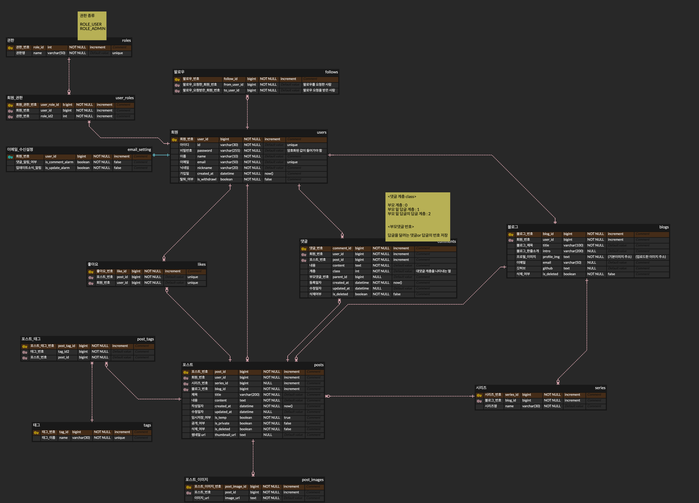

# 📄 목차
- [💬 프로젝트 소개](#-프로젝트-소개) 
- [🚀 핵심 기능](#-핵심-기능) 
- [🗓️ 작업 기간](#%EF%B8%8F-작업-기간) 
- [👩🏻‍💻 구성원](#-구성원) 
- [🛠️ 기술 스택](#%EF%B8%8F-기술-스택) 
- [🚧 아키텍처](#-아키텍처) 
- [🗂️ ERD 설계](#%EF%B8%8F-erd-설계) 
- [💪🏻 기술적 경험](#-기술적-경험) 
  - [트러블 슈팅](#트러블-슈팅) 
  - [공부 내용](#공부-내용) 
  - [개발 일지](#개발-일지) 
- [👥 프로젝트 회고](#-프로젝트-회고) 
 

# 💬 프로젝트 소개
 

# 🚀 핵심 기능
 

### 1. 회원가입
- [x] 회원 가입폼
- [x] 같은 ID, Email Check API
- [x] 회원 등록 기능
- [x] 회원 가입 후 로그인 폼으로 이동

### 2. 로그인
- [x] 로그인 폼 
- [x] 로그인 기능 
- [x] 로그인 성공 후 /로 이동
- [x] 로그인 실패 후 다시 로그인 폼으로 이동(오류 메시지 출력)
- [ ] Spring Security를 이용해 로그인 구현
  - [x] Form Login
  - [x] JWT Login
  - [ ] OAuth2 Login

### 3. 사이트 상단
- [x] 사이트 로고가 좌측 상단에 보여짐
- [x] 사이트 우측에는 로그인링크 또는 사용자 정보 보여짐
  - [x] 로그인을 안했을 경우엔 로그인 링크가 보여짐 
  - [x] 로그인을 했을 경우엔 사용자 이름이 보여짐 
  - [x] 사용자 이름을 클릭하면 설정, 해당 사용자 블로그 이동 링크, 임시 저장 글 목록 보기, 로그아웃이 있음

### 4. 로그아웃
- [x] 로그아웃

### 5. 메인 페이지 (/)
- [x] 블로그 글 목록 보기 
  - [x] 최신 순
  - [ ] 조회수 높은 순
  - [ ] 좋아요 순
- [x] 페이징 처리 또는 무한 스크롤 구현 
- [ ] 제목, 내용, 사용자 이름 중에 하나로 검색 기능

### 6. 블로그 글 쓰기
- [x] 블로그 제목, 내용, 사진 등을 입력하여 글을 씀 
- [x] "출간하기"를 누르면 블로그 썸네일(이미지), 공개유무, 시리즈 설정을 하고, 다시 출간하기를 누르면 글이 등록 됨 
- [x] 임시저장을 누르면 글이 임시 저장됨

### 7. 임시글 저장 목록 보기
- [ ] 3)처럼 회원 로그인을 하면, 임시 글 저장 목록 보기 링크가 있음. 해당 링크를 클릭하면 임시 글 저장 목록이 보여짐
- [ ] 임시 글 저장 목록의 글 제목을 클릭 하면 글을 수정할 수 있음
- [ ] 여기 에서 "임시저장" "출간하기" 를 할 수 있음

### 8. 특정 사용자 블로그 글 보기 (/@사용자아이디)
- [x] 사용자 정보 보기 
- [ ] 사용자가 쓴 글 목록 보기 
  - [ ] 최신순
  - [ ] 조회수 높은 순
  - [ ] 즐겨찾기순
- [ ] 페이징 처리 또는 무한 스크롤 구현 
- [ ] 사용자의 태그 목록 보기 (태그당 글의 수 보여줌)
- [ ] 제목, 내용 중에 하나로 검색기능

### 9. 시리즈 목록 보기
- [ ] 시리즈 목록 보기

### 10. 시리즈 제목 클릭시 시리즈에 포함된 블로그 글 목록 보여주기
- [ ] 시리즈에 속한 블로그 글 목록 보기

### 11. 블로그 글 상세 보기
- [x] 메인 페이지에서 제목을 클릭할 때 블로그 글 상세 보여짐 
- [ ] 특정 사용자 블로그에서 제목을 클릭할 경우 블로그 상세 보여짐 
- [ ] 시리즈에 속한 블로그 글 목록에서 제목을 클릭할 경우 블로그 글 상세 보여짐

### 12. 사용자 정보 보기
- [x] 사이트 상단에서 로그인 하였을 경우 설정을 클릭하면 사용자 정보가 보여지고 수정 가능 
- [x] 사용자 이름, 이메일 등이 출력됨
- [x] 회원 탈퇴 링크 제공

### 13. 회원 탈퇴
- [x] 회원 탈퇴를 하겠느냐는 폼이 보여짐 
- [x] 폼에서 확인을 하면 회원 탈퇴 (회원 정보 삭제)

### 14. 댓글 목록 보여주기
- [x] 블로그 글 상세보기를 들어가면 하단에 해당 글에 달린 댓글 목록이 보여짐
- [x] 댓글과 대댓글이 최신 댓글부터 보여짐 
- [x] 댓글은 최대 20개가 보여지고 페이징 처리가 됨

### 15. 댓글 달기
- [x] 블로그에 댓글을 달 수 있다
- [x] 댓글에 대댓글을 달 수 있다

### 16. 블로그 글에 좋아요 하기
- [ ] 블로그 글에 좋아요를 할 수 있다

### 17. 이 외의 기능

# 🗓️ 작업 기간
2024년 06월 18일 ~ 2024년 7월 일

 

# 👩🏻‍💻 구성원
BE 1명

 

# 🛠️ 기술 스택
 

# 🚧 아키텍처
 

# 🗂️ ERD 설계

 

# 💪🏻 기술적 경험
## 트러블 슈팅
 

## 공부 내용
 

## 개발 일지
 

# 👥 프로젝트 회고
 
